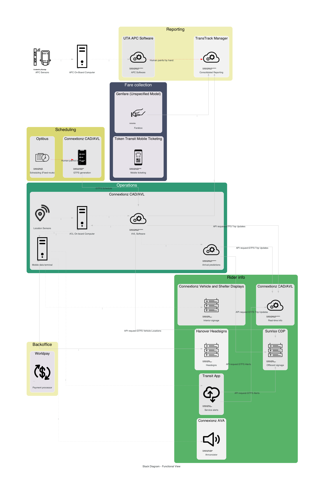

Transitstacks includes basic tools for downloading and viewing the [Cal-ITP](http://calitp.org) transit technology stack database including generating stack diagrams the example one below. 

## Licenses

- Code is offered as [AGPL 3.0](LICENSE) and developed on behalf of the [California Integrated Travel Project](http://calitp.org).  
- Data this code accesses and contains is offered as [CC BY-NC-SA 4.0](https://creativecommons.org/licenses/by-nc-sa/4.0/) and developed on behalf of the [California Integrated Travel Project](http://calitp.org). 

